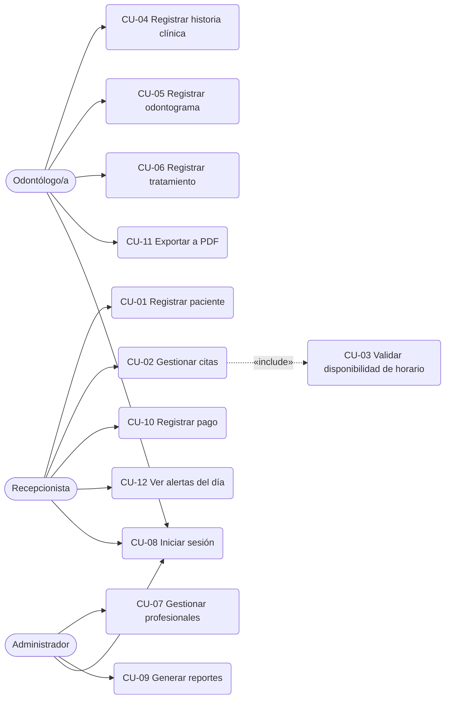

# Vyra — Casos de Uso

**Versión:** 0.1
**Fecha:** 2026-09-17

Este documento se deriva directamente de los Requerimientos Funcionales (RF) definidos en [`01-requerimientos.md`](./01-requerimientos.md). Cada caso de uso (CU) mantiene el mismo número que su RF de origen, para que sea fácil rastrear de dónde sale cada uno.

---

## 1. Diagrama de casos de uso

Mermaid no tiene un tipo de diagrama UML de casos de uso nativo, así que se representa con un diagrama de flujo: los actores a la izquierda, los casos de uso como óvalos, y las líneas indican qué actor participa en cada uno. La línea punteada de CU-02 a CU-03 es una relación **«include»** (CU-02 siempre dispara la validación de CU-03).

---

## 2. Especificación detallada

### CU-01 — Registrar paciente
- **Actor:** Recepcionista
- **Precondición:** El usuario inició sesión con un rol autorizado.
- **Flujo principal:**
  1. La recepcionista selecciona "Nuevo paciente".
  2. El sistema muestra un formulario (nombres, apellidos, DNI, fecha de nacimiento, teléfono, dirección, contacto de emergencia, alergias).
  3. La recepcionista completa los datos y confirma.
  4. El sistema valida que el DNI no esté duplicado.
  5. El sistema guarda el paciente y muestra confirmación.
- **Flujos alternativos:** Si el DNI ya existe, el sistema muestra un error y no guarda el registro.
- **Postcondición:** El paciente queda registrado y disponible para agendarle citas.

### CU-02 — Gestionar citas (agendar / reprogramar / cancelar)
- **Actor:** Recepcionista
- **Precondición:** El paciente y el profesional ya existen en el sistema.
- **Flujo principal:**
  1. La recepcionista busca al paciente.
  2. Selecciona "Nueva cita" e ingresa profesional, fecha, hora y motivo.
  3. El sistema ejecuta CU-03 (validar disponibilidad de horario).
  4. Si hay disponibilidad, el sistema guarda la cita con estado "Pendiente".
  5. El sistema muestra la cita en la agenda del profesional seleccionado.
- **Flujos alternativos:**
  - 3a. Si no hay disponibilidad, el sistema rechaza la cita y sugiere otro horario libre del mismo profesional.
  - Reprogramar: se repite desde el paso 2 sobre una cita existente.
  - Cancelar: la recepcionista cambia el estado de la cita a "Cancelada" (no se elimina, para mantener historial).
- **Postcondición:** La cita queda registrada, reprogramada o cancelada, con su estado actualizado.

### CU-03 — Validar disponibilidad de horario *(incluido por CU-02)*
- **Actor:** Sistema (no lo dispara un usuario directamente)
- **Flujo principal:**
  1. El sistema busca citas existentes del mismo profesional en la misma fecha.
  2. Compara los rangos de hora_inicio/hora_fin.
  3. Si hay traslape con una cita en estado "Pendiente" o "Confirmada", devuelve "no disponible".
- **Postcondición:** CU-02 recibe `true` o `false` para decidir si guarda la cita.

### CU-04 — Registrar historia clínica
- **Actor:** Odontólogo/a
- **Precondición:** El paciente ya tiene al menos una cita registrada.
- **Flujo principal:**
  1. El odontólogo abre el expediente del paciente desde la cita en curso.
  2. Selecciona "Nueva entrada de historia clínica".
  3. Registra antecedentes médicos, alergias, observaciones y diagnóstico.
  4. El sistema guarda la entrada asociada a la fecha y a la cita actual.
- **Postcondición:** La historia clínica del paciente queda actualizada con una nueva entrada (no se sobrescriben las anteriores).

### CU-05 — Registrar odontograma
- **Actor:** Odontólogo/a
- **Precondición:** El paciente está siendo atendido en una cita activa.
- **Flujo principal:**
  1. El odontólogo abre el odontograma del paciente (representación gráfica de las piezas dentales).
  2. Selecciona una pieza dental específica.
  3. Registra su estado (sana, cariada, obturada, extraída, en tratamiento).
  4. El sistema guarda el registro con la fecha, manteniendo el historial de estados anteriores de esa pieza.
- **Postcondición:** El odontograma refleja el estado más reciente de cada pieza, con historial consultable.

### CU-06 — Registrar tratamiento
- **Actor:** Odontólogo/a
- **Precondición:** Existe una cita y (usualmente) un registro de odontograma asociado.
- **Flujo principal:**
  1. El odontólogo selecciona "Nuevo tratamiento" desde la cita.
  2. Indica descripción, pieza(s) dental(es) involucradas y costo.
  3. El sistema guarda el tratamiento con estado "En curso".
  4. Al finalizar, el odontólogo actualiza el estado a "Finalizado".
- **Postcondición:** El tratamiento queda vinculado a la cita, al paciente y a las piezas dentales tratadas.

### CU-08 — Iniciar sesión / control de acceso
- **Actor:** Todos (Administrador, Recepcionista, Odontólogo/a)
- **Precondición:** El usuario tiene una cuenta creada por el Administrador.
- **Flujo principal:**
  1. El usuario ingresa usuario y contraseña.
  2. El sistema valida las credenciales (contraseña comparada como hash, nunca en texto plano).
  3. El sistema determina el rol y habilita únicamente las pantallas permitidas para ese rol.
- **Flujos alternativos:** Credenciales incorrectas → mensaje de error, sin indicar cuál de los dos datos falló (por seguridad).
- **Postcondición:** El usuario queda autenticado y ve solo lo que su rol permite.

### Casos de uso restantes (formato resumido)

| CU | Nombre | Actor | Resumen del flujo |
|---|---|---|---|
| CU-07 | Gestionar profesionales | Administrador | CRUD de odontólogos: nombres, especialidad, horario de atención. |
| CU-09 | Generar reportes | Administrador | Selecciona tipo de reporte (citas del día/semana, historial de paciente, ingresos por periodo) y rango de fechas; el sistema consulta la BD y muestra/exporta el resultado. |
| CU-10 | Registrar pago | Recepcionista | Selecciona un tratamiento o cita, ingresa monto, fecha y método de pago; el sistema lo asocia y actualiza el saldo. |
| CU-11 | Exportar a PDF | Odontólogo/a | Selecciona historia clínica u odontograma de un paciente y genera un PDF listo para imprimir. |
| CU-12 | Ver alertas del día | Recepcionista | Al iniciar sesión, el sistema muestra automáticamente las citas programadas para el día actual. |

---

*Siguiente documento: [`03-modelo-base-datos.md`](./03-modelo-base-datos.md) — las entidades usadas aquí (Paciente, Cita, Profesional, Tratamiento, Odontograma, Pago) se convierten en tablas.*
