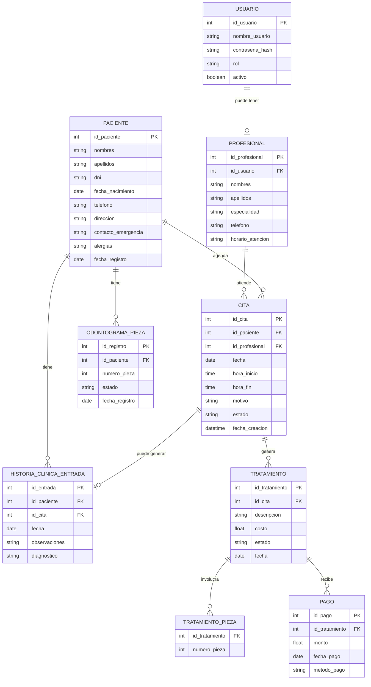

# Vyra — Modelo de Base de Datos

**Versión:** 0.1
**Fecha:** 2026-09-17
**Motor:** SQLite (según RNF-02 de los requerimientos)

---

## 1. Diagrama entidad-relación



**Notas de diseño:**
- `HISTORIA_CLINICA_ENTRADA` y `ODONTOGRAMA_PIEZA` son tablas de historial (cada fila es un registro con fecha), no se sobrescriben — así CU-04 y CU-05 pueden mostrar la evolución del paciente en el tiempo.
- `TRATAMIENTO_PIEZA` es una tabla intermedia porque un tratamiento puede involucrar más de una pieza dental (relación muchos a muchos).
- `PROFESIONAL.id_usuario` es opcional (puede haber profesionales sin cuenta de acceso propia, aunque no es lo recomendado).

## 2. Diccionario de datos

### USUARIO
| Campo | Tipo | Restricciones | Descripción |
|---|---|---|---|
| id_usuario | INTEGER | PK, autoincrement | Identificador único |
| nombre_usuario | TEXT | UNIQUE, NOT NULL | Usuario para iniciar sesión |
| contrasena_hash | TEXT | NOT NULL | Contraseña cifrada (nunca texto plano — RNF-05) |
| rol | TEXT | NOT NULL | `ADMIN`, `RECEPCION` u `ODONTOLOGO` |
| activo | INTEGER | NOT NULL, default 1 | 1 = habilitado, 0 = deshabilitado |

### PROFESIONAL
| Campo | Tipo | Restricciones | Descripción |
|---|---|---|---|
| id_profesional | INTEGER | PK, autoincrement | Identificador único |
| id_usuario | INTEGER | FK → USUARIO, NULL permitido | Cuenta de acceso asociada |
| nombres, apellidos | TEXT | NOT NULL | Datos personales |
| especialidad | TEXT | | Ej. Ortodoncia, Endodoncia |
| telefono | TEXT | | |
| horario_atencion | TEXT | | Ej. "Lun-Vie 9:00-18:00" |

### PACIENTE
| Campo | Tipo | Restricciones | Descripción |
|---|---|---|---|
| id_paciente | INTEGER | PK, autoincrement | Identificador único |
| nombres, apellidos | TEXT | NOT NULL | |
| dni | TEXT | UNIQUE, NOT NULL | Evita duplicados (CU-01) |
| fecha_nacimiento | TEXT (ISO 8601) | | |
| telefono, direccion | TEXT | | |
| contacto_emergencia | TEXT | | |
| alergias | TEXT | | Texto libre |
| fecha_registro | TEXT (ISO 8601) | default hoy | |

### CITA
| Campo | Tipo | Restricciones | Descripción |
|---|---|---|---|
| id_cita | INTEGER | PK, autoincrement | |
| id_paciente | INTEGER | FK → PACIENTE, NOT NULL | |
| id_profesional | INTEGER | FK → PROFESIONAL, NOT NULL | |
| fecha | TEXT (ISO 8601) | NOT NULL | |
| hora_inicio, hora_fin | TEXT (HH:MM) | NOT NULL | Usadas para validar cruces (CU-03) |
| motivo | TEXT | | |
| estado | TEXT | NOT NULL, default 'PENDIENTE' | `PENDIENTE`, `CONFIRMADA`, `ATENDIDA`, `CANCELADA` |
| fecha_creacion | TEXT | default ahora | |

### HISTORIA_CLINICA_ENTRADA
| Campo | Tipo | Restricciones | Descripción |
|---|---|---|---|
| id_entrada | INTEGER | PK, autoincrement | |
| id_paciente | INTEGER | FK → PACIENTE, NOT NULL | |
| id_cita | INTEGER | FK → CITA, NULL permitido | |
| fecha | TEXT | NOT NULL | |
| observaciones | TEXT | | |
| diagnostico | TEXT | | |

### ODONTOGRAMA_PIEZA
| Campo | Tipo | Restricciones | Descripción |
|---|---|---|---|
| id_registro | INTEGER | PK, autoincrement | |
| id_paciente | INTEGER | FK → PACIENTE, NOT NULL | |
| numero_pieza | INTEGER | NOT NULL | Notación FDI (11-48) |
| estado | TEXT | NOT NULL | `SANA`, `CARIADA`, `OBTURADA`, `EXTRAIDA`, `EN_TRATAMIENTO` |
| fecha_registro | TEXT | NOT NULL | |

### TRATAMIENTO
| Campo | Tipo | Restricciones | Descripción |
|---|---|---|---|
| id_tratamiento | INTEGER | PK, autoincrement | |
| id_cita | INTEGER | FK → CITA, NOT NULL | |
| descripcion | TEXT | NOT NULL | |
| costo | REAL | NOT NULL | |
| estado | TEXT | NOT NULL, default 'EN_CURSO' | `EN_CURSO`, `FINALIZADO` |
| fecha | TEXT | NOT NULL | |

### TRATAMIENTO_PIEZA
| Campo | Tipo | Restricciones | Descripción |
|---|---|---|---|
| id_tratamiento | INTEGER | FK → TRATAMIENTO | Clave compuesta |
| numero_pieza | INTEGER | | Clave compuesta |

### PAGO
| Campo | Tipo | Restricciones | Descripción |
|---|---|---|---|
| id_pago | INTEGER | PK, autoincrement | |
| id_tratamiento | INTEGER | FK → TRATAMIENTO, NOT NULL | |
| monto | REAL | NOT NULL | |
| fecha_pago | TEXT | NOT NULL | |
| metodo_pago | TEXT | | Ej. Efectivo, Yape, Tarjeta |

## 3. Script SQL (SQLite) listo para usar

```sql
CREATE TABLE usuario (
    id_usuario INTEGER PRIMARY KEY AUTOINCREMENT,
    nombre_usuario TEXT NOT NULL UNIQUE,
    contrasena_hash TEXT NOT NULL,
    rol TEXT NOT NULL CHECK (rol IN ('ADMIN','RECEPCION','ODONTOLOGO')),
    activo INTEGER NOT NULL DEFAULT 1
);

CREATE TABLE profesional (
    id_profesional INTEGER PRIMARY KEY AUTOINCREMENT,
    id_usuario INTEGER REFERENCES usuario(id_usuario),
    nombres TEXT NOT NULL,
    apellidos TEXT NOT NULL,
    especialidad TEXT,
    telefono TEXT,
    horario_atencion TEXT
);

CREATE TABLE paciente (
    id_paciente INTEGER PRIMARY KEY AUTOINCREMENT,
    nombres TEXT NOT NULL,
    apellidos TEXT NOT NULL,
    dni TEXT NOT NULL UNIQUE,
    fecha_nacimiento TEXT,
    telefono TEXT,
    direccion TEXT,
    contacto_emergencia TEXT,
    alergias TEXT,
    fecha_registro TEXT DEFAULT (date('now'))
);

CREATE TABLE cita (
    id_cita INTEGER PRIMARY KEY AUTOINCREMENT,
    id_paciente INTEGER NOT NULL REFERENCES paciente(id_paciente),
    id_profesional INTEGER NOT NULL REFERENCES profesional(id_profesional),
    fecha TEXT NOT NULL,
    hora_inicio TEXT NOT NULL,
    hora_fin TEXT NOT NULL,
    motivo TEXT,
    estado TEXT NOT NULL DEFAULT 'PENDIENTE'
        CHECK (estado IN ('PENDIENTE','CONFIRMADA','ATENDIDA','CANCELADA')),
    fecha_creacion TEXT DEFAULT (datetime('now'))
);

CREATE TABLE historia_clinica_entrada (
    id_entrada INTEGER PRIMARY KEY AUTOINCREMENT,
    id_paciente INTEGER NOT NULL REFERENCES paciente(id_paciente),
    id_cita INTEGER REFERENCES cita(id_cita),
    fecha TEXT NOT NULL,
    observaciones TEXT,
    diagnostico TEXT
);

CREATE TABLE odontograma_pieza (
    id_registro INTEGER PRIMARY KEY AUTOINCREMENT,
    id_paciente INTEGER NOT NULL REFERENCES paciente(id_paciente),
    numero_pieza INTEGER NOT NULL,
    estado TEXT NOT NULL
        CHECK (estado IN ('SANA','CARIADA','OBTURADA','EXTRAIDA','EN_TRATAMIENTO')),
    fecha_registro TEXT NOT NULL
);

CREATE TABLE tratamiento (
    id_tratamiento INTEGER PRIMARY KEY AUTOINCREMENT,
    id_cita INTEGER NOT NULL REFERENCES cita(id_cita),
    descripcion TEXT NOT NULL,
    costo REAL NOT NULL,
    estado TEXT NOT NULL DEFAULT 'EN_CURSO' CHECK (estado IN ('EN_CURSO','FINALIZADO')),
    fecha TEXT NOT NULL
);

CREATE TABLE tratamiento_pieza (
    id_tratamiento INTEGER NOT NULL REFERENCES tratamiento(id_tratamiento),
    numero_pieza INTEGER NOT NULL,
    PRIMARY KEY (id_tratamiento, numero_pieza)
);

CREATE TABLE pago (
    id_pago INTEGER PRIMARY KEY AUTOINCREMENT,
    id_tratamiento INTEGER NOT NULL REFERENCES tratamiento(id_tratamiento),
    monto REAL NOT NULL,
    fecha_pago TEXT NOT NULL,
    metodo_pago TEXT
);
```

Puedes guardar este script como `src/main/resources/com/vyra/schema.sql` y ejecutarlo una sola vez al iniciar la app si la base de datos no existe todavía.

---

*Siguiente documento: [`04-diagrama-clases.md`](./04-diagrama-clases.md) — cómo se traducen estas tablas a clases Java.*
