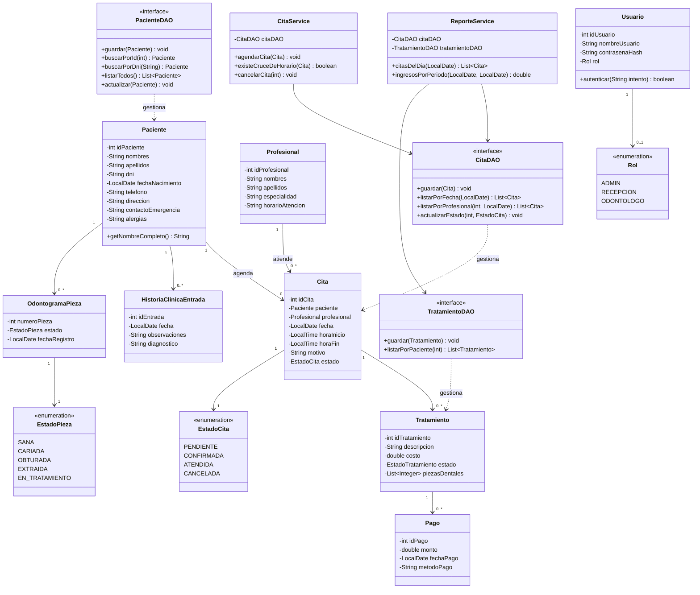

# Vyra — Diagrama de Clases

**Versión:** 0.1
**Fecha:** 2026-09-17

Este diagrama traduce el modelo de base de datos ([`03-modelo-base-datos.md`](./03-modelo-base-datos.md)) a clases Java, organizadas en capas (modelo, DAO, servicio) según RNF-06.

**Cómo leer esto para programarlo:**
- Las clases sin `<<interface>>` van en el paquete `com.vyra.model`.
- Las que terminan en `DAO` son interfaces en `com.vyra.dao`, con su implementación concreta (ej. `PacienteDAOSqlite implements PacienteDAO`) en el mismo paquete o en `com.vyra.dao.impl`.
- Las que terminan en `Service` van en `com.vyra.service` — ahí vive la lógica de negocio (como la validación de cruce de horario de CU-03), separada de la base de datos y de la interfaz.
- Los controladores de JavaFX (uno por pantalla FXML) usan estos servicios; no hablan directo con los DAO.

---

*Siguiente documento: [`05-arquitectura.md`](./05-arquitectura.md) — cómo se conectan estas capas entre sí.*
