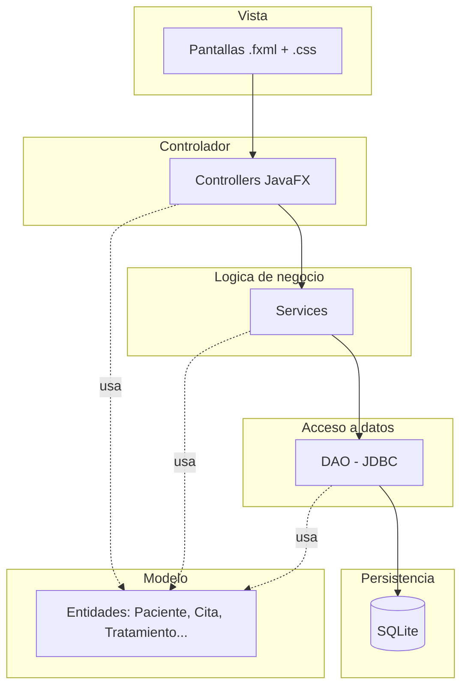

# Vyra — Arquitectura del Sistema

**Versión:** 0.1
**Fecha:** 2026-09-17

## 1. Estilo de arquitectura

Vyra usa una arquitectura en capas, combinada con el patrón MVC que impone JavaFX de forma natural a través de FXML. El objetivo es que cada capa dependa solo de la capa inmediatamente inferior, nunca al revés — esto es lo que pide RNF-06 y es también lo que hace mantenible el código para un equipo de 4 personas trabajando en paralelo.



## 2. Responsabilidad de cada capa

**Vista (FXML + CSS):** define solo la apariencia — botones, tablas, formularios. No contiene lógica.

**Controlador:** recibe los eventos de la vista (un clic en "Guardar", por ejemplo), valida datos básicos de formulario (campos vacíos, formato) y delega en un Service. Un controlador por pantalla (ej. `PacienteController`, `CitaController`).

**Servicio (lógica de negocio):** aquí viven las reglas del negocio que no son solo "guardar en la base de datos" — por ejemplo, `CitaService.existeCruceDeHorario()` (CU-03) o `ReporteService.ingresosPorPeriodo()` (CU-09). Los servicios no saben nada de JavaFX ni de SQL directamente; solo usan los DAO.

**DAO (Data Access Object):** cada entidad principal tiene su DAO (`PacienteDAO`, `CitaDAO`, etc.), responsable únicamente de las consultas SQL contra SQLite. Si el día de mañana migran de SQLite a MySQL (mencionado como posible en RNF-02), solo se reescriben los DAO — el resto del sistema no se entera del cambio.

**Modelo:** clases simples (POJOs) que representan las entidades — sin lógica de negocio ni de base de datos, solo atributos y getters/setters.

## 3. Estructura de paquetes 

```
com.vyra/
├── App.java                 (punto de entrada)
├── model/                   (Paciente, Cita, Profesional, Tratamiento, Pago, ...)
├── dao/                     (interfaces: PacienteDAO, CitaDAO, ...)
│   └── impl/                (implementaciones concretas con JDBC/SQLite)
├── service/                 (CitaService, ReporteService, ...)
├── controller/              (un controller por pantalla FXML)
└── util/                    (ConexionBD, utilidades de fecha, hash de contraseñas, etc.)
```

Y en recursos:

```
src/main/resources/com/vyra/
├── views/                   (archivos .fxml)
├── styles/                  (archivos .css)
└── schema.sql               (script de creación de tablas, ver 03-modelo-base-datos.md)
```

## 4. Cómo se conecta a la base de datos

Una única clase (`util.ConexionBD`), implementada como utilidad estática o singleton, abre la conexión JDBC a SQLite (`jdbc:sqlite:vyra.db`) y la reutiliza en toda la aplicación. Los DAO reciben o solicitan esa conexión — nunca abren su propia conexión por separado, para evitar bloqueos del archivo `.db` (SQLite no maneja bien muchas conexiones simultáneas).

## 5. División de trabajo sugerida para el equipo de 4

Con esta arquitectura, el trabajo se puede repartir por capa o por módulo sin que se pisen el código entre sí (cada quien trabaja en sus propias clases/paquetes):

| Persona | Posible responsabilidad |
|---|---|
| Daniel (líder) | `util/`, `dao/` base, integración general, `schema.sql` |
| Integrante 2 | Módulo de pacientes + citas (`model`, `dao`, `service`, `controller`, `view` de esas dos entidades) |
| Integrante 3 | Módulo de historia clínica + odontograma |
| Integrante 4 | Módulo de tratamientos + pagos + reportes |

Esto conecta directamente con la tabla de la sección 1.1 del documento de requerimientos — pueden completarla ahora con esta referencia.

---

*Siguientes documentos (se completan cuando el sistema ya esté funcionando): [`06-manual-usuario.md`](./06-manual-usuario.md) y [`07-memoria-descriptiva.md`](./07-memoria-descriptiva.md).*
